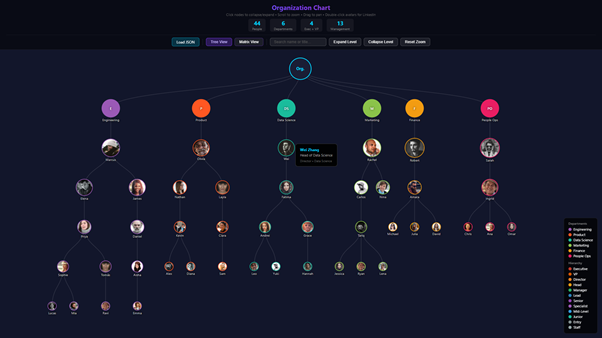
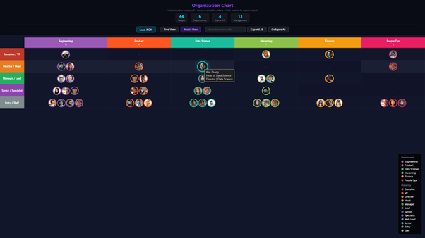

<p align="center"></p>

# LinkedIn OSINT Toolkit

An OSINT toolkit for discovering companies by region, scraping their employee data, and building organizational charts with role classification.

The toolkit follows a four-phase funnel: **discover** target companies in any region, **scrape** their employee data from LinkedIn, **classify** each person's role by hierarchy and division, and optionally **deep dive** into individual profiles. A single unified script (`osint_funnel.py`) chains all phases with one browser session. Results are explored in the interactive viewer (`src/org_chart_viewer.html`). For a detailed look at the architecture, see the [Architecture](docs/ARCHITECTURE.md) document.

## Features

- **OSINT Company Discovery** - Find companies in any region via LinkedIn search (configurable geo codes)
- **Employee Scraping** - Extract employee names, titles, and profile URLs from company pages
- **Role Classification** - Classify job titles by hierarchy (Executive to Junior) and division (Cyber, IT, Finance, etc.)
- **Org Chart Generation** - Build structured organizational data and interactive visualizations
- **Batch Support** - Optionally process multiple companies with session management
- **Profile Deep Dive** - Extract detailed profile data (about, experience, education, skills)
- **AI Enhancement** - Optional Groq LLM integration for smarter classification and relevance scoring (`--use-ai`)
- **Anti-Detection / Stealth** - Browser fingerprint evasion: UA rotation, viewport randomization, WebDriver hiding, human-like timing, WebRTC/telemetry disabling
- **Proxy Support** - Route traffic through SOCKS5 or HTTP proxies (`--proxy socks5://host:port`)
- **Graceful Interruption** - Ctrl+C or OTP timeout saves partial results; resume later with `--input`

## Demo / Example Output

The standalone viewer (`src/org_chart_viewer.html`) supports two visualization modes -- load any pipeline JSON and toggle between them:

| Tree View | Matrix View |
|:---------:|:-----------:|
|  |  |

A demo dataset is included at `examples/demo_org_chart.json` for testing.

## Prerequisites

- **Python 3.8+**
- **Firefox** browser (the toolkit uses Selenium with the Firefox WebDriver)
- **geckodriver** (auto-installed at runtime via `webdriver-manager`)

## Installation

```bash
# Clone the repository
git clone https://github.com/OWNER/linkedin-osint-toolkit.git
cd linkedin-osint-toolkit

# Create and activate a virtual environment
python -m venv venv
source venv/bin/activate  # Linux / macOS
# venv\Scripts\activate   # Windows

# Install dependencies
pip install -r requirements.txt
```

## Configuration

Copy the example environment file and fill in your credentials:

```bash
cp .env.example .env
```

| Variable | Required | Description |
|----------|----------|-------------|
| `LINKEDIN_EMAIL` | Yes | Your LinkedIn login email |
| `LINKEDIN_PASSWORD` | Yes | Your LinkedIn password |
| `GROQ_API_KEY` | No | Groq API key for AI-enhanced classification (`--use-ai` flag). Free at [console.groq.com](https://console.groq.com) |
| `LOG_LEVEL` | No | Logging verbosity: `DEBUG`, `INFO`, `WARNING`, `ERROR` (default `INFO`) |
| `LOG_FILE` | No | Path to a log file, e.g. `output/toolkit.log` |
| `PROXY_URL` | No | Default proxy URL (e.g., `socks5://127.0.0.1:9050`) |

See the [Usage Guide](docs/USAGE.md) for details on session handling, OTP approval, and troubleshooting.

## Usage

### Quick Start -- Full Funnel (recommended)

The unified funnel script chains all phases (discover, scrape, classify) with **one browser session**:

```bash
# Discover cybersecurity companies in the USA, scrape employees, classify
python src/osint_funnel.py --geo-code 103644278 --keyword "cybersecurity" --limit 5

# Resume from an existing file (auto-detects format and starting phase)
python src/osint_funnel.py --input output/discovered_companies_usa_20260215_120000.json

# Include deep dive on top 20 profiles
python src/osint_funnel.py --geo-code 103644278 --keyword "fintech" --limit 3 --deep-dive --deep-dive-limit 20

# Route through a SOCKS5 proxy for IP rotation
python src/osint_funnel.py --geo-code 103644278 --keyword "defense" --limit 5 --proxy socks5://127.0.0.1:9050
```

Approve the OTP on your phone when prompted (one-time).

### Quick Start -- Single Company

For a single company, the pipeline script is a simpler entry point:

```bash
python src/osint_pipeline.py acme-corp -e your@email.com -p yourpassword

# Re-run classification on an existing CSV (no browser needed)
python src/osint_pipeline.py --skip-scrape -c output/linkedin_company_acme_20260214.csv
```

All output files are saved to a flat `output/` directory with unique timestamped names:
- `output/discovered_companies_*_TIMESTAMP.json` -- discovered companies
- `output/all_companies_people_TIMESTAMP.json` -- batch scraped people
- `output/linkedin_company_*_TIMESTAMP.csv` -- single company scraped data
- `output/org_chart_TIMESTAMP.json` -- classified org chart data

To visualize results, open `src/org_chart_viewer.html` in your browser and load any JSON file. The viewer supports Tree and Matrix views with search, zoom, and expand/collapse.

Additional flags: `--max-pages`, `--max-profiles` (scraping limits), `--headless`, `-v` (verbose), `--use-ai` (AI-enhanced classification), `--proxy` (SOCKS5/HTTP proxy).

> **Anti-Detection**: All scripts automatically apply stealth measures (UA rotation, viewport randomization, human-like timing). Use `--proxy` for IP rotation. Press Ctrl+C at any time to save partial results.

### AI Enhancement (Optional)

Add `--use-ai` to any command to enable Groq LLM-powered classification. This requires a `GROQ_API_KEY` in your `.env` file (free at [console.groq.com](https://console.groq.com)). AI never replaces the keyword classifier -- it only enhances results when confidence is high.

```bash
# AI-enhanced classification during the pipeline
python src/osint_pipeline.py acme-corp -e your@email.com -p yourpassword --use-ai

# AI relevance scoring for company discovery
python src/osint_discover.py --geo-code 103644278 --keyword "cybersecurity" --use-ai --search-objective "defense contractors with SOC teams"

# AI deep classification using full profile data (about, experience, education)
python src/osint_scrape_profiles.py results.json --use-ai
```

The toolkit supports three independent depth levels -- enter at any level:

| Level | What it does | AI enhancement |
|-------|-------------|----------------|
| **Macro** | Discover companies by industry/country | Score relevance to your search objective |
| **Medium** | Scrape employee lists + classify titles | Refine hierarchy/department using title context |
| **In-depth** | Deep dive into individual profiles | Classify using full bio, career history, education |

### Advanced: Individual Scripts

For more control, each pipeline phase can be run as a standalone script. See the [Usage Guide](docs/USAGE.md) for full details.

| Script | Purpose |
|--------|---------|
| `src/osint_funnel.py` | **Unified funnel**: discover -> scrape -> classify -> deep dive |
| `src/osint_pipeline.py` | Single-company pipeline: scrape -> classify -> org chart |
| `src/osint_discover.py` | Discover companies by region (`--list-geo-codes`, `--list-industries`) ([OSINT Methodology](docs/OSINT_METHODOLOGY.md), [Reference Tables](docs/REFERENCE.md)) |
| `src/osint_scrape_company.py` | Scrape a single company's employees |
| `src/osint_scrape_batch.py` | Batch scrape from a TXT/JSON list |
| `src/osint_scrape_profiles.py` | Deep dive into individual profiles (about, experience, education, skills) |
| `src/osint_build_orgchart.py` | Build org chart data from scraped CSV |
| `src/osint_generate_html.py` | Generate org chart HTML (legacy matrix view) |
| `src/osint_stats.py` | Analyze classification statistics |
| `src/osint_scan.py` | Scan results and suggest classification overrides |

> **Note:** All scripts read `LINKEDIN_EMAIL` and `LINKEDIN_PASSWORD` from `.env` automatically. You can also pass `-e`/`-p` flags to override.

For the full step-by-step walkthrough, login/session handling, and troubleshooting, see the [Usage Guide](docs/USAGE.md).

## Project Structure

```
linkedin/
├── src/
│   ├── osint_funnel.py                # Unified funnel: discover -> scrape -> classify -> deep dive
│   ├── osint_pipeline.py              # Single-company pipeline (login + scrape + classify)
│   ├── osint_auth.py                  # Shared login & session module (with stealth integration)
│   ├── osint_stealth.py               # Anti-detection: UA rotation, viewport, timing, proxy
│   ├── osint_discover.py              # Macro: find companies by region
│   ├── osint_scrape_company.py        # Medium: scrape single company employees
│   ├── osint_scrape_batch.py          # Medium: batch scrape multiple companies
│   ├── osint_scrape_profiles.py       # In-depth: deep dive individual profiles
│   ├── osint_classify_rules.py        # Classify: keyword-based title classifier
│   ├── osint_classify_ai.py           # Classify: optional Groq AI enhancement
│   ├── osint_build_orgchart.py        # Output: build org chart JSON from CSV
│   ├── osint_generate_html.py         # Output: legacy HTML chart generator
│   ├── osint_stats.py                 # Analysis: classification statistics
│   ├── osint_scan.py                  # Analysis: classification scanner
│   ├── org_chart_viewer.html          # Standalone interactive org chart viewer (D3.js)
│   ├── classification_rules.json      # Classification rules (~30K profiles)
│   └── prompts/                       # AI system prompts and skill definitions
│       ├── system_prompt.md
│       ├── skill_classify.md
│       ├── skill_score.md
│       └── tool_definitions.md
├── tests/
│   └── __init__.py                     # Test package (tests are run via Makefile)
├── docs/
│   ├── ARCHITECTURE.md                 # System design & data flow diagrams
│   ├── USAGE.md                        # Step-by-step usage guide
│   ├── REFERENCE.md                    # Role levels, geo codes, industry categories
│   └── OSINT_METHODOLOGY.md           # Discovery strategies & enrichment techniques
├── examples/
│   ├── companies_list.txt.example      # Example batch input file
│   └── demo_org_chart.json             # Demo dataset for the org chart viewer
├── assets/                             # Logo and screenshot images
├── .github/
│   ├── workflows/ci.yml               # GitHub Actions CI pipeline
│   ├── ISSUE_TEMPLATE/                 # Bug report & feature request templates
│   └── PULL_REQUEST_TEMPLATE.md        # PR checklist
├── pyproject.toml                      # Packaging & tool configuration
├── requirements.txt                    # Python dependencies
├── Makefile                            # install / lint / test shortcuts
├── .env.example                        # Environment variable template
├── .editorconfig                       # Editor formatting rules
├── CONTRIBUTING.md                     # Contributor guidelines
├── CHANGELOG.md                        # Version history
├── CODE_OF_CONDUCT.md                  # Community standards
├── SECURITY.md                         # Vulnerability disclosure policy
├── LICENSE                             # MIT License
└── output/                             # Runtime results (gitignored)
```

## Documentation

| Document | Description |
|----------|-------------|
| [Usage Guide](docs/USAGE.md) | Step-by-step usage, login/session handling, troubleshooting |
| [Architecture](docs/ARCHITECTURE.md) | System design, data flow diagrams, module relationships |
| [Reference Tables](docs/REFERENCE.md) | Role classification levels, geo codes, industry categories |
| [OSINT Methodology](docs/OSINT_METHODOLOGY.md) | Company discovery strategies and enrichment techniques |

## Legal Disclaimer

This tool is for educational and security research purposes only. Ensure compliance with LinkedIn's Terms of Service and applicable laws. The authors are not responsible for misuse.

## Contributing

Contributions are welcome! Please read the [Contributing Guide](CONTRIBUTING.md) before opening a pull request. For security vulnerabilities, see [SECURITY.md](SECURITY.md).

## License

This project is licensed under the [MIT License](LICENSE).
