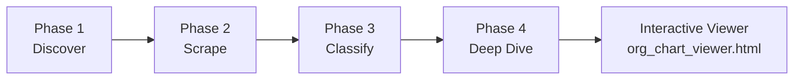
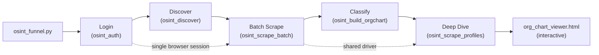
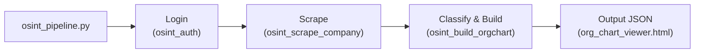
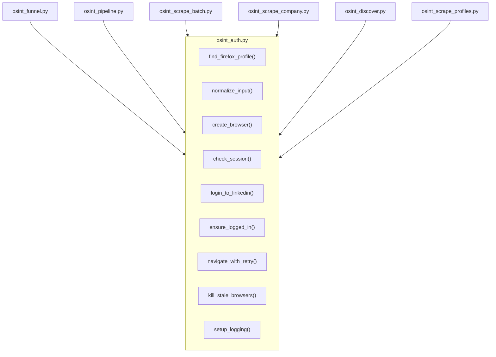
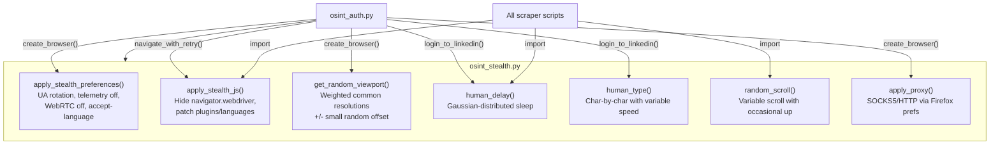
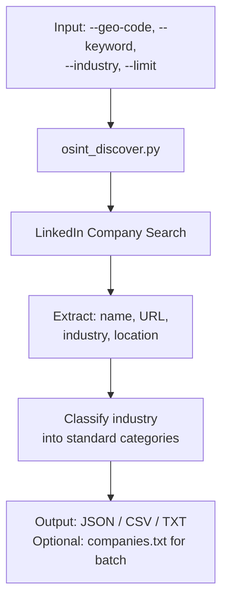
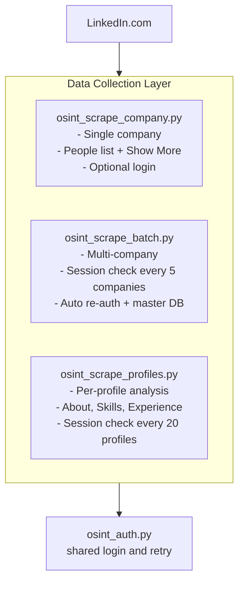
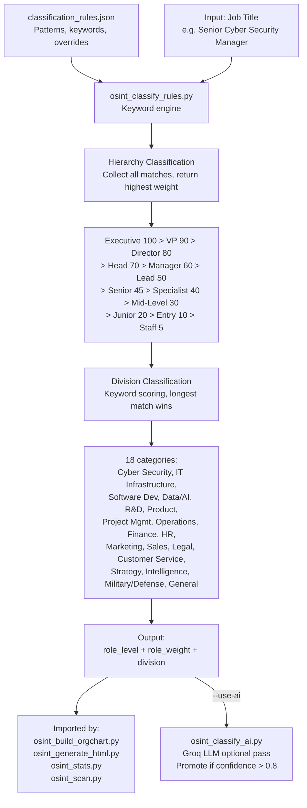
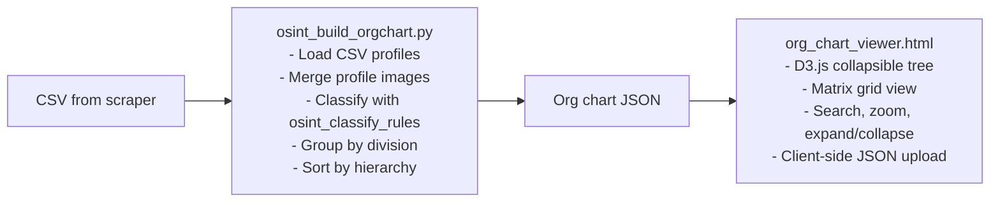
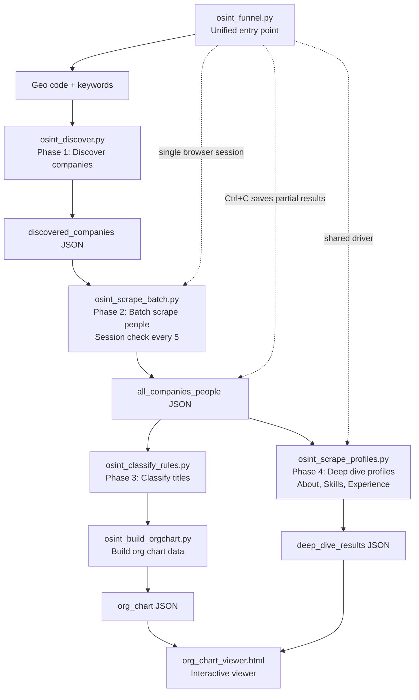

# LinkedIn OSINT Toolkit - Architecture

## System Overview



The toolkit follows a four-phase funnel: discover target companies, scrape employee data, classify roles by hierarchy and division, and optionally deep dive into individual profiles. Results are explored in the interactive viewer (`src/org_chart_viewer.html`).

---

## Unified Funnel: `osint_funnel.py`

The recommended entry point is `osint_funnel.py`, which orchestrates the full macro-to-micro funnel using a **single browser session**. This solves LinkedIn's session-only cookie problem -- since cookies are lost when the browser closes, the funnel keeps the browser open throughout all phases.



The funnel imports each phase as a module, passing the browser instance (`driver`) throughout so no re-authentication is needed. Supports `--start-phase` / `--end-phase` to run any slice, and `--input` to resume from an existing output file.

## Single-Company Pipeline: `osint_pipeline.py`

For single-company workflows, `osint_pipeline.py` provides a simpler entry point that handles login, scraping, and classification:



---

## Shared Module: `osint_auth.py`

All scrapers and the unified pipeline import from a single shared login module to ensure consistent authentication behavior.



| Function | Purpose |
|----------|---------|
| `find_firefox_profile()` | Auto-detect user's Firefox profile directory (native, Snap, Flatpak) |
| `normalize_input()` | Normalize company name/URL to people page URL |
| `create_browser()` | Create Firefox WebDriver with profile session and resilient geckodriver resolution |
| `check_session()` | Validate if LinkedIn session is active |
| `login_to_linkedin()` | Full login with Welcome Back + OTP handling |
| `ensure_logged_in()` | Check session, re-authenticate if expired |
| `navigate_with_retry()` | Navigate with exponential backoff + auth retry |
| `kill_stale_browsers()` | Kill orphaned geckodriver/firefox processes to prevent file locks |
| `setup_logging()` | Configure logging level and optional log file for the toolkit |

---

## Stealth Module: `osint_stealth.py`

Centralized anti-detection module imported by `osint_auth.py` and all scraper scripts. Designed around **consistency over randomization** -- coherent browser personas rather than suspicious mixed signals.



| Function | Purpose |
|----------|---------|
| `apply_stealth_preferences()` | Firefox prefs: hide WebDriver, rotate UA, disable telemetry/WebRTC |
| `apply_stealth_js()` | JS patches after each navigation: `navigator.webdriver`, plugins, languages |
| `get_random_viewport()` | Weighted random desktop resolution (avoids full-screen fingerprinting) |
| `get_random_user_agent()` | Recent Firefox Linux UA with weighted version selection |
| `human_delay()` | Gaussian-distributed sleep (natural timing, not uniform) |
| `human_type()` | Character-by-character typing with variable speed and occasional pauses |
| `random_scroll()` | Human-like scrolling (variable distance, occasional scroll-up) |
| `apply_proxy()` | SOCKS5/HTTP proxy via Firefox preferences (DNS routed through proxy) |

---

## Phase 1: Company Discovery



---

## Phase 2: Data Collection



### Collection Scripts

| Script | Purpose | Input | Output |
|--------|---------|-------|--------|
| `osint_auth.py` | Authenticate and save session | Email, Password | Firefox profile with session |
| `osint_scrape_company.py` | Scrape single company | Company URL/name | CSV with people |
| `osint_scrape_batch.py` | Scrape multiple companies | `list.txt` or JSON | JSON per company + master DB |
| `osint_discover.py` | Discover companies by region | Geo code, keywords | JSON/CSV/TXT |
| `osint_scrape_profiles.py` | Analyze individual profiles | Profile URLs (JSON) | Detailed profile JSON |

---

## Phase 3: Classification

All classification patterns, keywords, and overrides are stored in `src/classification_rules.json` (learned from ~30K real profiles). The `osint_classify_rules.py` module is the engine -- it loads the JSON at import time and exposes the public API. To tune classification, edit the JSON file directly.



### Optional AI Enhancement

When `--use-ai` is passed, the `osint_classify_ai.py` module makes Groq API calls to enhance classification results. AI never replaces keyword rules -- it adds `ai_*` fields and only promotes the AI result when confidence is high and the keyword result was low-confidence. System prompts are loaded from `src/prompts/`.

| Level | Function | What it does |
|-------|----------|-------------|
| Macro | `score_companies()` | Score discovered companies for relevance to a search objective |
| Medium | `enhance_classifications_batch()` | Batch-enhance title classifications (10 per API call) |
| In-depth | `deep_classify()` | Classify using full profile data (about, experience, education) |

### Classification Analysis Tools

| Script | Purpose | Input | Output |
|--------|---------|-------|--------|
| `osint_stats.py` | Analyze hierarchy/division distribution | JSON data files | Terminal report with unclassified samples |
| `osint_scan.py` | Scan a directory of company JSONs, suggest new overrides | Directory path | Distribution report + suggested `title_overrides` |

---

## Output & Visualization



---

## Complete Data Flow



---

## File Structure

```
linkedin/
|
|-- src/                                # Main source code
|   |-- osint_funnel.py               # Unified funnel: discover -> scrape -> classify -> deep dive
|   |-- osint_pipeline.py              # Single-company pipeline (login + scrape + classify)
|   |-- osint_auth.py                  # Shared: login, session, retry, URL normalization (stealth integrated)
|   |-- osint_stealth.py              # Anti-detection: UA rotation, viewport, timing, proxy support
|   |-- osint_discover.py             # Macro: company discovery by region
|   |-- osint_scrape_company.py       # Medium: single company scraper
|   |-- osint_scrape_batch.py         # Medium: multi-company batch scraper
|   |-- osint_scrape_profiles.py      # In-depth: individual profile analyzer
|   |-- osint_classify_rules.py       # Classify: keyword-based role/division engine
|   |-- osint_classify_ai.py          # Classify: optional Groq AI enhancement
|   |-- classification_rules.json     # Classification patterns, keywords, overrides (~30K profiles)
|   |-- osint_build_orgchart.py       # Output: org chart data builder (CSV input)
|   |-- osint_generate_html.py        # Output: legacy HTML chart generator
|   |-- org_chart_viewer.html         # Standalone interactive viewer (D3.js tree + matrix)
|   |-- osint_stats.py               # Analysis: classification statistics
|   |-- osint_scan.py                # Analysis: classification scanner with override suggestions
|   +-- prompts/                      # AI system prompts and skill definitions
|       |-- system_prompt.md
|       |-- skill_classify.md
|       |-- skill_score.md
|       +-- tool_definitions.md
|
|-- tests/                            # Test suite
|   +-- __init__.py                   # Test package
|
|-- docs/                             # Documentation
|   |-- ARCHITECTURE.md               # This file
|   |-- USAGE.md                      # Detailed usage guide
|   |-- REFERENCE.md                  # Classification tables and geo codes
|   +-- OSINT_METHODOLOGY.md          # OSINT approach guide
|
|-- examples/                         # Example input files
|   |-- companies_list.txt.example
|   +-- demo_org_chart.json           # Demo dataset for the org chart viewer
|
|-- .github/                          # GitHub CI and templates
|   |-- workflows/ci.yml
|   |-- ISSUE_TEMPLATE/
|   +-- PULL_REQUEST_TEMPLATE.md
|
|-- assets/                           # Logo and screenshot images
|-- output/                           # Results directory (gitignored)
|-- pyproject.toml                    # Packaging and tool configuration
|-- requirements.txt                  # Python dependencies
|-- Makefile                          # install / lint / test shortcuts
|-- .env.example                      # Environment variable template
|-- .editorconfig                     # Editor formatting rules
|-- CONTRIBUTING.md                   # Contributor guidelines
|-- CHANGELOG.md                      # Version history
|-- SECURITY.md                       # Vulnerability disclosure policy
|-- .gitignore
|-- LICENSE                           # MIT License
+-- README.md
```

---

*Architecture document for the LinkedIn OSINT Toolkit*
